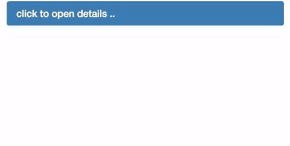

# knockout-toggle-click

> Knockout JS toggle binding handler for click events

By [v-braun - www.dev-things.net](http://www.dev-things.net).

## Example



``` js
var bindingRoot = document.getElementById('root');
var vm = {
  showDetails: ko.observable(false) 
};
ko.applyBindings(vm, bindingRoot);
```

``` html
<div id="root" class="panel panel-primary">
  <div data-bind="toggleClick: showDetails" class="panel-heading">
    <h3 class="panel-title">click to open details ..</h3>
  </div>
  <div data-bind="visible: showDetails" class="panel-body">Lorem ipsum dolor sit amet, consectetur adipisicing elit, sed do eiusmod
  tempor incididunt ut labore et dolore magna aliqua. Ut enim ad minim veniam,
  quis nostrud exercitation ullamco laboris nisi ut aliquip ex ea commodo
  consequat. Duis aute irure dolor in reprehenderit in voluptate velit esse
  cillum dolore eu fugiat nulla pariatur. Excepteur sint occaecat cupidatat non
  proident, sunt in culpa qui officia deserunt mollit anim id est laborum.</div>
</div>
```

Have a look at the *Test* directory.

## Installation

### NPM

```bash
npm install knockout-toggle-click --save
```

### Bower

```bash
bower install knockout-toggle-click --save
```


### Known Issues

If you discover any bugs, feel free to create an issue on GitHub fork and
send me a pull request.

[Issues List](https://github.com/v-braun/knockout-toggle-click/issues).

## Authors

  
[v-braun](https://github.com/v-braun/)


## Contributing

1. Fork it
2. Create your feature branch (`git checkout -b my-new-feature`)
3. Commit your changes (`git commit -am 'Add some feature'`)
4. Push to the branch (`git push origin my-new-feature`)
5. Create new Pull Request


## License

See [LICENSE](https://github.com/v-braun/knockout-toggle-click/blob/master/LICENSE).